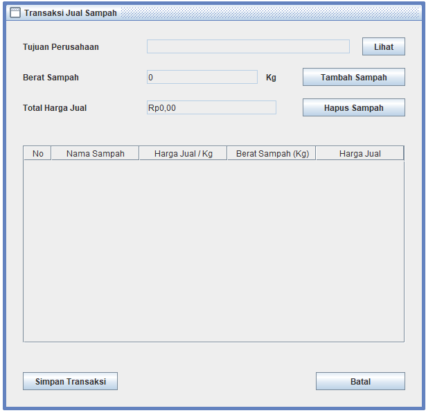

# Bank Sampah
Tugas Besar Pemprograman II - Semester 5 - Universitas Pamulang

## Cara Penggunaan
1. Install Netbeans, Xampp
2. Buka Phpmyadmin lalu buat database `project_uas`
3. Import database project_uas dengan cara drag and drop project_uas.sql ke dalam area phpmyadmin
4. Open project di netbeans
5. Build/run/debug project netbeans
6. Login dengan username: `cham` dan password: `123`

## Note
Jika build project, jangan lupa untuk meng copy folder `report` pada folder `src` ke folder `dist/src`, jika folde `src` di dist tidak ada, maka buat folder baru dengan nama `scr`

## Librari yang Digunakan
- bcrypt
- bytes
- commons-beanutils
- commons-collections
- commons-collections
- commons-digester
- commons-logging
- groovy-all
- gson
- iText
- jasperreports
- poi
- Mysql Driver

## Screenshot Aplikasi
### Login

### Halaman Utama

### Master Data Pelanggan

### Master Data Sampah

### Master Data Perusahaan

### Transaksi Beli (Pelanggan ke Pengepul)

### Transaksi Jual (Pengepul ke Perusahaan)

### Laporan Masuk

### Laporan Keluar

